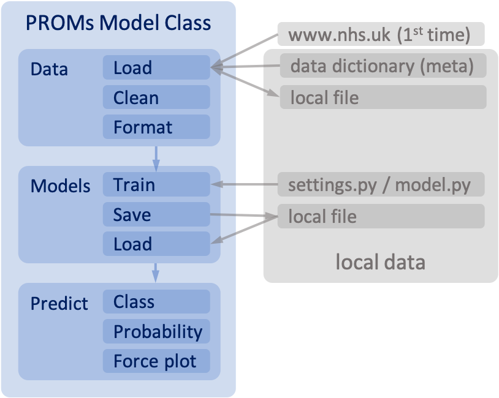
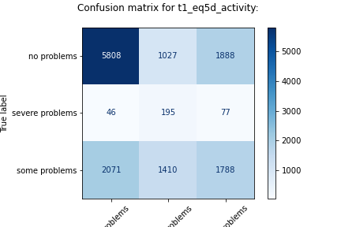
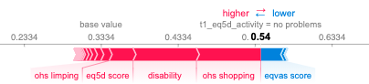

# NHS-PROMs case study

## General description

### Context

This is the repository of group #5 for the NHS case study of the JADS executive track. The case study itself is on the
NHS Digital PROMs data of hip and knee replacements. A model has been made that predicts a score on dimensions like
mobility and discomfort after the surgery based on a questionaire before the surgery. The model predicts the outcome,
the likeliness of it and explains why it predicts it. This can be of help for surgeon and patient to manage and explain
expectations.

### Group 5 team members
- Lidwine Chang
- Madou Derksen
- Laurence Frank
- Frank Niemantsverdriet
- Bram Vonk

### Model Class

A class is managing the data cleaning, model training and results evaluation.

The key features of this setup are:

- full support for hip and knee surgery PROMs
- Multiple dimensions as predictions
- Free choice via settings of
    - outputs, including bins for numerical outputs
    - gridsearch models and hyper parameters
    - Shap force plots on individual predictions

The general functionality of the class is depicted below:



The first time when the model requires PROMs data, these are downloaded and unzipped from the NHS site in the uk. After
this first run the required data is stored locally on your machine for the sake of speed.

There was no trend detected throughout the years. So the data set was split as following:
- For training the period April 2015 - April 2018 is used.
- For validation the period April 2019 - April 2020 is used.


Via [settings.py](./NHS_PROMs/settings.py) or [model.py](./NHS_PROMs/model.py) a lot of items can be tweaked from outputs up to hyperparameters.

## Getting started

### Setting up a Conda environment

#### Create

- Clone this git repository: `git clone <git url>`
- Start your conda prompt and go to your local repository folder: `cd <path to local repository>`
- Create a new environment named "jads" from the YML-file: `conda env create --file environment.yml`
- Activate the new environment: `conda activate jads`
- Start jupyter: `jupter notebook`

#### Update (e.g. after new requirements)

There are two ways possible:

- From your active environment: `conda env update --file environment.yml`
- If your environment is not activated: `conda env update --name jads --file environment.yml`

#### Remove

- Make sure that environment is not active. Otherwise, deactivate it: `conda deactivate`
- Remove environment: `conda env remove --name jads`

### Using the class `PROMsModel`

Import the class definition:

```
from NHS_PROMs.master_class import PROMsModel
```

Create an instance of the class for hip surgery:

```
PM = PROMsModel(kind='hip')
```

Loading pretrained models (stored in the directory `./models`) can be done with the
method `load_models(filename=filename.mdl)`. If no filename is provided, it will load the latest trained model for this
surgery. The method can also be used in a chained way, since it returns the class itself:

```
PM = PROMsModel(kind='hip').load_models()
```

To train models yourself simply use the method `train_models()`. 
This will train perform a GridSeachCV for all models for every output.
To save the results after training, simply use the method `save_models(filename)`. 
If no filename is provided, an unique name will be generated and the model is stored in the directory `./models`.
A script to train and save models for hip surgery could look like this:
```
PM = PROMsModel(kind=kind).train_models().save_models()
```

The trained models can be checked by printing the classification reports:
```
PM.classification_reports()

>>Classification report for t1_eq5d_activity:
>>
>>                 precision    recall  f1-score   support
>>
>>    no problems       0.73      0.67      0.70      8723
>>severe problems       0.07      0.61      0.13       318
>>  some problems       0.48      0.34      0.40      5269
>>
>>       accuracy                           0.54     14310
>>      macro avg       0.43      0.54      0.41     14310
>>   weighted avg       0.62      0.54      0.57     14310
```
Also the confusion matrices can be plotted by (the argument save is default False, setting it as True will save the images as *.png):
```
cp = PM.confusion_plots(save=True)
```


After loading or training the models, you can use the class to predict output labels.
For this the model needs input features in the right format. 
Below is a some code that takes a sample form the validation/test data set:
```
df_data = PM.load_data(mode="test").sample()
X, Y = PM.split_XY(df_data)
```

This sample X can be used to make predictions:
```
PM.predict(X)

>> {'t1_eq5d_activity': array(['no problems'], dtype=object)}
```

And even the probability of all the labels can be predicted (order is set in [settings.py](./NHS_PROMs/settings.py)):
```
PM.predict_proba(X)

>> {'t1_eq5d_activity': array([[0.5410129 , 0.2988908 , 0.16009627]], dtype=float32)}
```

To retrieve what is driving the odds for the dominant label a SHAP force plot can be made by:
```
PM.force_plots(X)
```


(X is an optional parameter for the method `force_plots()`. Without it, a random sample is used from the validation/test set.)